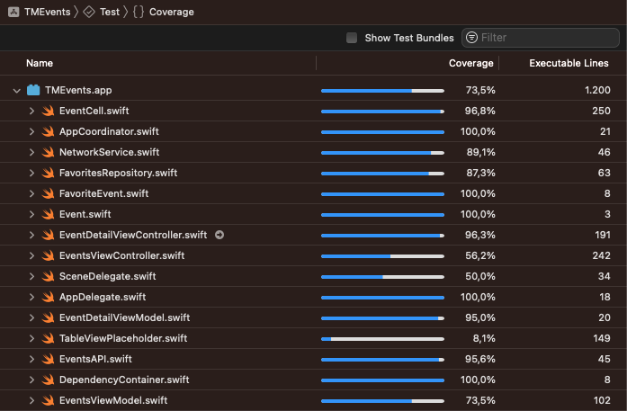

# TMEvents

TMEvents is an iOS application that interfaces with the Ticketmaster API to provide users with a simple and easy way to discover events. It allows users to browse, search, and favorite events.

## Table of Contents
1. [TMEvents](#tmevents)
2. [TODO](#todo)
3. [Features](#features)
4. [UI](#ui)
5. [Architecture](#architecture)
    - [Key Components](#key-components)
    - [Design Patterns and Best Practices](#design-patterns-and-best-practices)
6. [Testing and Code Coverage](#testing-and-code-coverage)
7. [Setup](#setup)
8. [Screenshots](#screenshots)

## TODO

- [x] Architecture
- [x] Requests and Decoding
- [x] Listing
- [x] Detail
- [x] Search
- [x] Pagination
- [x] Error handling
- [x] Dependency Injection
- [x] CoreData
- [x] Networking Unit Tests
- [x] ViewModels Unit Tests
- [x] ViewControllers Unit Tests
- [ ] Models Unit Tests
- [x] Repository Unit Tests
- [x] UI Tests
- [ ] Localization
- [ ] Accessibilityity
- [x] README

## Features

- **Browse Events**: View a list of events sourced from the Ticketmaster API with infinite scrolling.
- **Search Functionality**: Search for events using specific keywords.
- **Event Details**: Access detailed information about each event.
- **Favorites**: Mark events as favorites.
- **Error Handling**: The app handles poor connectivity situations by caching responses.

## UI

The UI is straightforward, featuring list and detail views.

- **Font Sizes**: Utilizes the `Dynamic Type` feature, allowing users to choose the size of textual content displayed on the screen.
- **Icons**: Employs `SF Icons` to save disk space for assets.
- **Theme**: Supports Light and Dark modes.
- **Devices**: Selects the best image resolution to display based on the device.

## Architecture

TMEvents employs the Model-View-ViewModel (MVVM) architectural pattern, ensuring a clear separation of concerns. It also has a networking layer abstracted through protocols to interact with the Ticketmaster API.

### Key Components:

- **Networking**: `EventsAPI` and `NetworkService` for API interactions.
- **Models**: Data structures representing events, conforming to `Codable`.
- **View Controllers**: `EventsViewController` for list displays and `EventDetailViewController` for details.
- **Custom Views**: `EventCell` to display event information.
- **View Models**: The ViewModels manage data presentation and user interactions.
- **Persistence**: `CoreData` to store favorite events.

### Design Patterns and Best Practices:

- **Repository Pattern**: For scalable and maintainable data logic.
- **Delegation**: For view controller callbacks.
- **Dependency Injection**: For decoupling and testing of components.

## Testing and Code Coverage

The project includes unit tests for Networking, ViewModels, ViewControllers, and Persistence. The current code coverage is 70.7%.

## Setup

The project setup is straightforward, with no external dependencies, making it easy to build. Just clone, open, build & run!

## Screenshots

  
  
  

  
  
  

